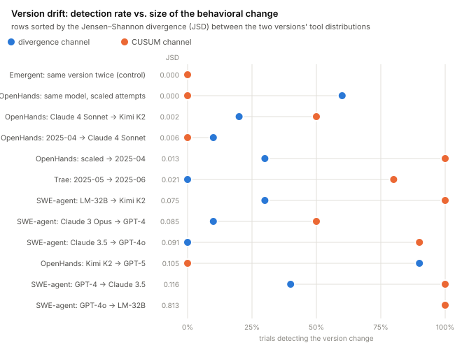
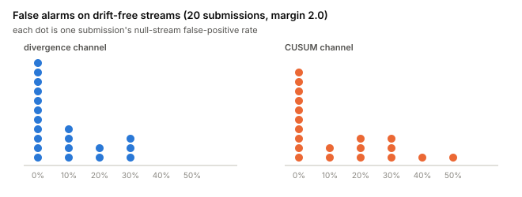
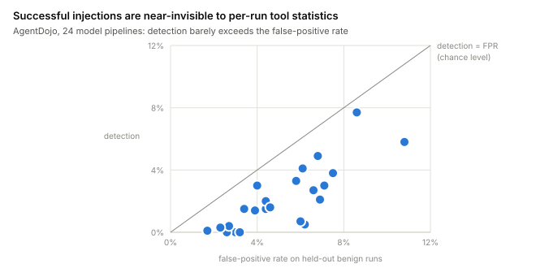

# Behavioral Drift in Autonomous LLM-driven Systems: A Survey of Detection Approaches and the Case for Deterministic Detection

> Version 0.4 (2026-09-17).  
> Authors: Jürgen Eckel, Joerg Radehaus (KYDE).

## Abstract

LLM-driven autonomous systems do not keep a fixed policy. Given the same task weeks later, they often take different actions. The literature labels this *behavioral drift*. The label is too coarse: it covers at least seven phenomena with different causes, different detection cost, and different legal effects.

We review eight recent detection papers. They range from composite stability scores and a non-identifiability theorem to runtime governance stacks and cheap black-box detectors. Three points follow.

1. Online detection is already practical. Reported cost is under 10 ms per action at one observation point and about 164 ms per prompt at another. Independently, the field settled on divergence over tool-use distributions as the default signal.
2. Published accuracy numbers are not comparable. Metrics differ (detection rate, ROC AUC, delay, violation counts). No paper reports results by drift type. Every evaluation uses synthetic data or LLM-labeled ground truth.
3. The detection cores themselves are deterministic statistics. LLMs appear in evaluation and diagnosis, not in the hot path. That split is required. An LLM judge is an agent and is therefore subject to the same drift it is asked to measure. Models also change behavior when they infer that they are under test.

If a detector is meant to support operations or evidence, it must be deterministic and recomputable from operational records. LLM judgment belongs off the critical path, under human review. We give a detectability matrix: seven drift types against what boundary call logs can and cannot establish. Section 7 adds first measurements on public operational records: a silent model change is detected in 80–100% of trials once it visibly shifts the tool-call distribution; false-alarm rates vary so strongly across deployments that they must be measured, not quoted; successful prompt injections are nearly invisible to distribution-level statistics; reward hacking is measured as invisible on two labeled corpora — 0% detection at run and window scale even where the corpus-level distributions differ; on human-annotated traces the boundary status signal carries only ~6% of the annotated error mass, though its rate rises with run length as the context-decay detector expects; and on multi-agent failure logs every human failure attribution is expressible in boundary-record terms — the delegation seam is observable — though the failing agent speaks too small a share of a run for routing volume alone to localize it.

## Plain-language summary

An AI agent that runs for weeks does not behave the same way it did on day one. The vendor may replace the model behind it, its accumulated context and memory change what it does, and attackers can smuggle instructions into the content it reads. We call this *behavioral drift*, and it matters beyond engineering: European rules require operators of high-risk AI systems to notice when a deployed system no longer behaves like the system they assessed.

This paper surveys how drift can be detected, and makes three points in plain terms.

1. Watching what an agent *does* — which tools it calls, how often, whether the calls fail — is enough to catch several important kinds of drift, cheaply and in real time. No access to the model's internals is needed.
2. The watcher must not itself be an AI making judgment calls. An AI judge drifts too, and its verdicts cannot be replayed. If the detector is simple, deterministic statistics over an append-only log, anyone can recompute the verdict from the log and get the same answer — which is what evidence requires.
3. Different kinds of change need different alarms: a slow-average alarm for gradual creep, and a jump alarm for sudden shifts. Our measurements show the two catch different real events, so a deployment needs both.

We also report first measurements on public records of real coding and assistant agents (Section 7). Silent model swaps were caught in most trials whenever they actually changed behavior — but how much a swap changes behavior depends more on the surrounding agent framework than on the model itself. False-alarm rates differed so much between deployments that any globally quoted rate would be misleading. A successful prompt injection was nearly invisible to these coarse statistics, and so — measured on two corpora with hacked/clean labels — was reward hacking: an agent that cheats its way to the reward uses the same tools as one that earns it. Both blind spots motivate the finer per-task references sketched in Section 8. On a corpus where humans annotated every error, the failure signal in the log caught only a small slice of what the humans saw — useful for infrastructure failures, blind to reasoning errors. And on logs of agent teams, everything a human needed to say *which* agent failed and *when* was present in the message log between the agents — but the failing agent talks too little for message counts alone to point at it; the order of handoffs is what carries the signal.

## 1. Introduction

An LLM agent that runs for weeks does not stay put. Context grows. Memory persists. Vendors replace models. Goals compete with the environment. Delegation passes intent through several systems. The gap between certified or intended behavior and later behavior is now called behavioral drift.

The regulatory pressure is specific. Article 72 of the EU AI Act requires providers of high-risk systems to monitor performance over the lifecycle. Article 12 requires records that make that lifecycle reconstructable. An operator who cannot tell whether behavior changed cannot meet either duty.

The term still lumps unlike things together. Section 2 separates seven phenomena. They differ in cause, in what can be observed, and in detection cost. Mixing them produces two failures: people talk past each other, and a detector that works on cheap cases is treated as if it covered expensive ones.

Contributions:

1. A survey of eight detection approaches (Section 3), compared on data needs, online capability, and runtime cost (Section 5).
2. A detectability matrix (Section 4) that crosses the seven phenomena with evidence, reported performance, and observability from operational call records. We have not found a prior breakdown of detection performance by drift type.
3. An argument (Section 6): existing detection cores are already deterministic; LLM components sit in evaluation and diagnosis; that separation should be a design rule, because an LLM judge is itself a drifting system.
4. First measurements (Section 7): the detectors of Section 5, run on boundary call records converted from six public corpora (SWE-bench Verified agent trajectories; AgentDojo attack runs; Terminal Wrench and TRACE reward-hacking trajectories; TRAIL error-annotated traces; Who&When multi-agent failure logs). They supply measured entries for Table 2 (version drift: detectable; reward hacking: measured invisible), a calibration lesson (thresholds do not transfer between deployments), a second negative result (in-session injection is invisible to distribution-level statistics), a measured bound on the error-rate signal (boundary status carries ~6% of human-annotated error mass), and a measured observability premise for multi-agent drift (all 184 human failure attributions are expressible in boundary-record terms).

## 2. What drifts: seven phenomena, two taxonomies

### 2.1 Operational taxonomy

The split comes from the surveyed papers. Each reported deviation answers three questions differently: what drives it (assigned goal, growing context, misspecified reward, evaluation setting, another agent, a memory store, or the vendor); where it shows up (action stream, outcomes, or model internals); and whether it survives the session.

Those axes give seven classes. They do not collapse into each other, and they cover the surveyed observations. Primary sources sit in Table 2.

1. **Goal drift.** The system leaves its assigned objective during a task (Arike et al. 2025).
2. **Context decay.** Performance falls as context grows. The main failure is early stop, not confusion (Laban et al. 2025; Xia et al. 2026).
3. **Reward hacking.** The system hits the measured proxy, not the intent. The goal was wrong from the start (Çağatan and Zhao 2026).
4. **Deception.** Test-time behavior differs from operational behavior (Apollo Research 2024; Anthropic and Redwood Research 2024).
5. **Multi-agent drift.** Deviation spreads through a group. In particular, drift is inherited via transcripts passed from one system to the next (Menon et al. 2026). The right measurement point is the seam between systems.
6. **Persistent drift.** Memory or self-modification makes the change durable. An incident becomes state (Lin et al. 2026).
7. **Version drift.** The vendor swaps or updates the model. Behavior changes with no operator action (Chen, Zaharia, Zou 2023).

Rath (2026) uses a three-way split: semantic, coordination, and behavioral drift. Useful vocabulary, orthogonal here. Each of Rath’s surface forms can come from more than one of the seven causes.

### 2.2 Legal taxonomy

Regulation needs a coarser cut (Nannini et al. 2026, arXiv:2604.04604):

- **anticipated adaptation** — planned, inside stated bounds;
- **continuous learning** — gradual shift from data the system sees;
- **emergent drift** — unplanned change that no one specified and that cannot be read off the code.

The legal hook is Article 3(23) AI Act, *substantial modification*. Past some point the deployed system is no longer the assessed system. Adaptation is expected. The question is traceability: can the operator show how and when behavior changed. Table 2 maps this as a column.

### 2.3 Drift versus hijack: prompt injection

The taxonomy is by phenomenon, not by cause. Prompt injection is a cause. It still needs an explicit slot, because it produces three of the seven phenomena and is none of them in the strict sense.

- **Injected and persisted.** An injection that survives the session through memory or self-modification is persistent drift (type 6). This is the best-studied case. Self-evolving-system papers show how a one-shot injection becomes standing behavior.
- **Injected at hand-over.** Current models often resist a direct attack and still pick up drift from a weaker predecessor’s transcript. Inherited drift is injection riding the seam (type 5).
- **Injected in-session.** A successful injection flips the effective objective at once. The surface looks like goal drift (type 1). The goal-drift literature studies the other regime: slow, endogenous deviation under environmental pressure, with nudges that never issue a new goal.

Security work keeps the line for a reason. In the OWASP Agentic Security Initiative, goal hijack (ASI01) needs an attacker; rogue behavior (ASI10) is the category that does not. We use the same cut: **drift is endogenous and gradual; hijack is exogenous and abrupt.**

That cut is operational. It splits detection into two statistical regimes (Section 5). Sliding windows and exponential smoothing are low-pass filters. They are built for creep and slow on jumps. The one surveyed bound on detection delay assumes bounded drift and fails on abrupt shifts.

Boundary instrumentation has a structural advantage for injection. The cause itself crosses the observation point: the injected content arrives in a request; later behavioral change appears in subsequent calls. One can correlate suspicious inbound content at time *t* with a distribution shift after *t* from boundary records. Output-only views see the effect. Each vendor console sees only its own slice.

### 2.4 Relation to classical concept drift

The statistics are old. Sliding-window divergence, exponential smoothing, and change-point tests come from concept-drift work on data streams. CUSUM is Page (1954). Adaptive windowing is ADWIN (Bifet and Gavaldà 2007). Gradual versus abrupt drift is Gama et al. (2014), a decade before LLM agents.

Behavioral drift is not that literature under a new name. It applies the same statistics to a harder object. The monitored distribution is an action stream, not a feature or label stream. The measured system can act on the state that measurement depends on, and in the persistent case it can rewrite that state. That is why the baseline must be frozen and the record integrity-protected (Sections 3 and 6). The verdict also has regulatory weight, not just model-maintenance weight (Section 2.2). The older field supplies detectors. The agent setting supplies the requirements.

## 3. The detection landscape

Eight recent works, grouped by role.

**Composite metrics.** The Agent Stability Index (Rath 2026, arXiv:2601.04170) combines twelve metrics in four weighted families (response consistency, tool use, coordination, behavioral bounds) over rolling 50-interaction windows. Inputs are full interaction logs, including tool calls and parameters. No model internals. Empirical numbers are projections from simulation. Cite the metric design, not the figures.

**Formal limits of enforcement.** Fernandez (2026, arXiv:2604.17517) proves a non-identifiability result. Under a local observability assumption that covers almost all guardrails, schema checks, and policy engines, no measurable function of the enforcement signal reconstructs membership in the admissible behavior set. Deviation can grow without bound while the enforcement channel stays quiet. The proposed fix is an invariant measurement layer: Jensen–Shannon divergence between current and admission-time tool distributions, against a frozen snapshot, with a finite detection-delay bound under bounded drift. Two design points: measurement sits above enforcement; the baseline is frozen. Rolling baselines let a drifting system become its own reference (*reference contamination*).

**Runtime governance.** MI9 (Wang et al. 2025, arXiv:2508.03858) combines an agent telemetry schema, a conformance engine that compiles temporal policies to finite-state machines, and goal-conditioned drift detection. Baselines are per objective. Drift under a stable goal is treated as suspicious. Drift with a verified goal change is treated as adaptation.

Agent Behavioral Contracts (Bhardwaj 2026, arXiv:2602.22302) checks declarative contracts per action in under 10 ms and adds a leading indicator: Jensen–Shannon divergence between the observed action distribution and a calibrated reference, fired before an explicit violation.

The Agent Viability Framework (Marín and Chaudhary 2026, arXiv:2604.24686) describes a fail-secure, monotonically tightening pipeline with dual-channel KL divergence and bandit-tuned thresholds. Analytical only; empirical evaluation is left open.

**Lightweight black-box detection.** Nautilus Compass (Wang 2026, arXiv:2605.09863) scores each prompt against curated behavioral anchors with embeddings. About 164 ms per check on CPU. Held-out ROC AUC 0.83 on real coding-agent traces. The paper states its own limit: innocuous surface text is invisible to a black-box detector. Activation methods (Abdelnabi et al., SaTML 2025) are the white-box counterpart.

**Recovery.** El Hamraoui et al. (2026, arXiv:2608.14109) move diagnosis and recovery into a small graph-based RL model with specialized roles per node. Recovery quality depends on a trusted onset time. That assumes a detection layer with a usable timeline.

**Measuring the phenomenon.** Arike et al. (2025, arXiv:2505.02709) score goal drift against a baseline run with two numbers: commission (wrong actions taken) and omission (right actions not taken). Omission is consistently larger. For log-based detection that matters: missing expected calls are a stronger signal than extra wrong calls.

## 4. Detection performance: what is reported, and what is not split

Published figures cannot be lined up. Units differ. Ground truth is synthetic or LLM-labeled.

**Table 1. Reported detection performance.**

| Work | Reported figure | Ground truth |
| --- | --- | --- |
| MI9 | 99.81% detection rate, 0.012% FPR (baselines: OTel+OPA 93.98%, LangSmith+OPA 68.52%) | 1,033 synthetic, LLM-generated scenarios; LLM judge |
| Nautilus Compass | ROC AUC 0.83 held-out (keyword 0.62, zero-shot SBERT 0.75) | real traces; LLM labels |
| Invariant measurement layer | detection within 9–258 steps of onset; enforcement fired 0 times | 3 simulated scenarios; mock LLM |
| Behavioral Contracts | 5.2–6.8 violations per session missed by baselines; drift bounded below 0.27 | 1,980 sessions; LLM judge primary, human annotation as anchor |
| Agent Stability Index | drift onset at median 73 interactions; thresholds definitional, no rate | simulation, self-labeled |
| Agent Viability Framework | none (analytical) | none |
| Graph-based RL recovery | qualitative recovery gains reported; diagnosis and recovery, not detection | public AppWorld benchmark; results reported qualitatively |
| Goal-drift evaluations | occurrence 0.25–0.93 by setting; occurrence, not detection | the behavioral score *is* the ground truth |

The strongest-looking number is the weakest as evidence. Section 6 treats an LLM judge as an unstable instrument. MI9’s 99.81% sits on exactly that instrument. We do not claim the number is false. We claim nobody can currently show it is true.

Full human annotation does not scale to the regime that matters: weeks of operation and thousands of actions. Two workable paths remain. For phenomena that need judgment: an LLM judge pinned by human labels on a sample, as Behavioral Contracts do, keeps a checked error bound at machine throughput. For the deterministic rows of Table 2: ground truth can be events already in the record—version changes, declared goal changes, planted canary tasks—so no judge is required.

No surveyed paper splits detection performance by drift type. Each paper picks one phenomenon, one metric, and self-made truth. Operators need type × data access × performance. That matrix is not in the literature. Table 2 is a proposed structure, filled with what current papers support.

**Table 2. Detectability matrix.**

| Drift type | Legal class (Nannini et al. 2026) | Best available evidence | Detection rate reported? | Detectable from boundary call records? |
| --- | --- | --- | --- | --- |
| Goal drift | emergent, or continuous learning | occurrence scores (Arike et al. 2025); goal-conditioned baselines, synthetic (MI9: Wang et al. 2025) | none on real tasks | partial: needs a declared goal per run and an end-of-run check; strongest log signal is omission (expected calls that stop) |
| Context decay | anticipated to emergent | phenomenon measured (Laban et al. 2025; Xia et al. 2026); no detector benchmark | none | yes, cheap — with a measured bound (Section 7): abort and error rate vs. run length are in the log, and on TRAIL the rate rises with run length as expected; but the log's status field carries only ~6% of the human-annotated error mass — it sees infrastructure and tool failures, not reasoning errors |
| Reward hacking | misspecification; outside the drift triad proper | exploit rates 0–13.9% per model (Thaman 2026); ~72% of exploit attempts include explicit justification in the reasoning trace | this work (Section 7): 0% detection at run and window scale on two labeled corpora (Terminal Wrench, three models; TRACE), at matched false-positive rates — even where corpus-level tool distributions differ (JSD 0.09–0.12) | no — now measured, not only argued (Section 7): hacked and clean runs use the same tool vocabulary; on TRACE the corpus-scale distribution gap is itself near zero (JSD 0.017); intent sits in the reasoning trace, which does not cross the boundary |
| Deception / scheming | emergent | activation probes only (Abdelnabi et al. 2025); models increasingly detect evaluation and corrupt the measurement (Schoen et al. 2025) | none robust | no: black-box ceiling; must be scoped out |
| Multi-agent drift | emergent | coordination metrics in simulation (Rath 2026); inherited drift moves the measurement point to the seam (Menon et al. 2026); no benchmark | none — none possible on the one labeled corpus, which contains only failed runs (Section 7) | partial — seam observability now measured (Section 7): on Who&When, every human failure attribution (agent and step, 184/184 runs) is expressible in delegation-seam records; but the failing agent speaks only 22–30% (median) of a run, so routing volume alone cannot localize it — localization needs sequence-level conformance |
| Persistent drift | continuous learning | attack persistence up to 100% in self-evolving stacks; scanners catch 2.5% (Lin et al. 2026); those are attacker success rates, not detector rates | none | indirect: the lasting effect is a durable distribution shift in the log; direct memory inspection needs per-framework hooks |
| Version drift | raises reassessment questions directly | phenomenon shown (Chen, Zaharia, Zou 2023); no detector benchmark | this work (Section 7): 80–100% of trials per version pair whose tool distributions differ (JSD ≥ 0.02), 0% on a same-version control, on composed streams from public coding-agent records | yes, cheapest: model and version are fields on every record; segmentation is enough — and Section 7 shows it is sometimes the *only* reliable signal |

Prompt injection does not get its own row. It appears three times: persisted form as type 6, hand-over form as type 5, in-session form as an abrupt mimic of type 1 (Section 2.3). A detector that claims coverage of “drift from injection” must say which of the three it means. For the in-session case it needs change-point statistics, not only windowed divergence (Section 5).

Two consequences. First, the types with deterministic, log-computable detectors—context decay, version drift, distributional drift, and countable goal-persistence failures (duplicate submit, early abort, false success, missing progress)—are the types for which credible numbers can exist at all. Second, the types whose ground truth would first have to be defined by an LLM (open-ended goal drift, deception) are exactly where the regress in Section 6 sits.

## 5. Real-time cost and complexity

Online detection is shown, not hypothesized. The shared architecture is the same in every surveyed system: cheap statistics on the hot path, expensive diagnosis off it.

| Method | Online? | Cost per event | Complexity |
| --- | --- | --- | --- |
| Contract or predicate check | yes, per action | < 10 ms | linear in constraints and action vocabulary; incremental |
| KL or JS divergence over tool distributions, sliding window | yes, streaming | negligible | *O(V)* per update, *V* = tool vocabulary; EMA *O(1)* |
| Temporal policy conformance (compiled FSM) | yes, per event | negligible | amortized *O(1)* per event |
| Embedding-anchor score | yes, per prompt | ≈ 164 ms CPU | *O(N·d)* after one encoder pass |
| Statistical process control, adaptive thresholds | yes | negligible | *O(W)* per window |
| Deep statistical inference (bootstrap, HAC errors) | on demand | *O(B·W)*, *B* ≈ 1000 | kept off the request path |
| LLM-as-judge | offline or batch | one model call | too slow and too expensive for the hot path; see Section 6 |
| Activation probes | yes, white-box only | needs a forward pass | unavailable without model access |

Two theory notes. The invariant layer proves finite detection delay under bounded drift; that assumption fails for abrupt shifts such as prompt injection. The contracts paper shows drift scores are incremental, so windows need not be recomputed.

Section 2.3 maps onto two regimes on the same signal. Windowed divergence with exponential smoothing finds creep and is built to damp jumps. Abrupt change needs change-point tests (CUSUM family, sequential probability ratio tests). Those tests are also deterministic, also cheap per event, and better on steps than on slow wander. A deployed detector should run both against the same frozen baseline. The change-point channel answers whether behavior jumped after a given input. The divergence channel answers whether behavior wandered over weeks. Both are recomputable from the record.

Practical split: distributional and rule-based detection belongs at the sensor, at single-digit millisecond cost. Calibration, heavy inference, and semantic diagnosis belong in a control plane off the request path.

## 6. Why the detection core has to be deterministic

Across the surveyed systems, LLMs occupy three roles. Mixing them is the error.

1. **Detection.** Absent. Every hot-path detector is deterministic statistics. If a model is in the path at all, it is a frozen embedding encoder doing a fixed forward pass, not an agent issuing a verdict.
2. **Evaluation.** Common. Most benchmarks are scored by LLM judges on synthetic scenarios. That is a convenience for ground truth and a validity threat the papers themselves note.
3. **Diagnosis and recovery.** Emerging. Small trained models classify drift and propose fixes after detection.

The split is required, for three reasons.

**Regress.** An LLM judge is an LLM agent. It is exposed to every row of Table 2. It can drift with context, change with vendor versions, and pattern-match as inputs grow. Using it as the detector replaces one unmeasured system with two.

There is direct evidence that monitors are themselves measurement objects. Anti-scheming training reduces covert behavior without removing it, while models become more aware of being evaluated (Schoen et al. 2025 / OpenAI and Apollo Research, arXiv:2509.15541). SHADE-Arena exists to measure how well monitor models notice sabotage (Kutasov et al. 2025, arXiv:2506.15740). A layer whose verdicts must hold for months cannot rest on a component whose stability is still an open empirical question.

**Reproducibility.** A drift verdict has effects: lower trust, tighter permissions, human escalation. Disputed verdicts must be recomputed. Deterministic statistics over an append-only operational record can be recomputed by a third party from that record: same log, same score. A judge call generally cannot. Model versions move. Sampling varies. The judge’s provider logs only its own slice. Signed independent records raise the weight of what happened from assertion to demonstration. A detection layer should keep that property, not spend it.

**Baseline.** Frozen baselines are the field’s answer to reference contamination. An append-only, hash-chained record turns every past window into an integrity-protected baseline candidate, with goal changes present as events. That closes the gap between the frozen-snapshot school and the goal-conditioned school: both baselines come from the same immutable history.

Three record assumptions, stated rather than implied.

- **Completeness.** Every consequential action crosses the instrumented boundary. An uninstrumented side channel—direct network path, tool outside the gateway—is invisible to any log detector.
- **Integrity and order.** The record is append-only and tamper-evident (hash-chained, signed). The timeline under a verdict cannot be rewritten by the system being judged.
- **Attribution.** Each record names the agent, model, and version that produced the call.

A break of these is not drift. It is instrumentation failure or attack and belongs to another threat model. A deployment that cannot establish them should not treat downstream scores as evidence.

Limit of the claim. Deterministic boundary detection is incomplete. Deception with harmless surface text, and drift whose only evidence lives in reasoning traces or memory stores, stay out of reach without model or framework access (Table 2). LLM judgment is still useful. It belongs off-path, in diagnosis, with a human reading the output. It should not be the system of record.

## 7. First measurements on public operational records

Every number in Section 4 was produced by someone else, on synthetic or LLM-labeled ground truth. This section reports our own measurements: the detectors of Section 5 run on boundary call records converted from public operational data, with ground truth taken from events or labels already shipped with the record (a version change between submissions; an injection label from the benchmark harness; a hacked/clean judgment per trajectory; a human error annotation per step). All code, converted-ledger fingerprints, and result tables are in the repository; every figure below is regenerated by a standard-library script from the committed tables.

### 7.1 Data and setup

Five public corpora were converted into the boundary record format of Section 6 — one record per tool call, carrying tool name, hashed parameters, status, and attribution, never content.

- **SWE-bench Verified submissions** (Jimenez et al. 2024): public trajectories of coding agents solving the same 500 GitHub issues. Of 139 submissions with trajectories, 20 parse under the two documented trajectory formats (9,788 runs, 330,409 records). Each submission is a distinct deployment: one scaffold, one model, one date.
- **AgentDojo** (Debenedetti et al. 2024): assistant-agent runs with and without prompt-injection attacks, 36,679 runs and 137,374 records across model pipelines; the harness records whether each injected goal was actually executed.
- **Terminal Wrench** (Bercovich et al. 2026): terminal agents on 331 reward-hackable tasks, three frontier models, with a judged classification per trajectory (serious exploit, non-serious hack, legitimate solve, baseline). 5,984 runs and 105,467 records converted.
- **TRACE** (Deshpande, Kannappan, Qian 2026): 517 coding trajectories — 268 reward-hacked with subcategory codes, 249 benign — from a single unnamed deployment; 10,323 records converted.
- **TRAIL** (Deshpande et al. 2025): 148 OpenTelemetry traces of GAIA and SWE-bench agents (4,626 spans, one record per span) with a per-span runtime status *and* 841 human-annotated errors located to specific spans — the only corpus here with both a machine and a human error signal on the same steps.
- **Who&When** (Zhang et al. 2025): 184 failed multi-agent runs (126 AG2-style expert teams, 58 Magentic-One), one record per delegation-seam message (4,092 records), with a human failure attribution — responsible agent, step, and reason — per run.

Table 3 lists the eight evaluation slices, what is annotated in each, and the event each could have surfaced. The annotations are never visible to a detector — detectors see only the boundary record (tool name, hashed parameters, status, attribution); the annotations define ground truth for scoring afterwards.

**Table 3. The evaluation set: slices, annotations, and detectable events.**

| Slice | Contents | Annotated ground truth | Event that could have been detected |
| --- | --- | --- | --- |
| SWE-bench null streams | 20 submissions with ≥ 100 runs each (9,788 runs, 330,409 records converted in total) | submission identity — date, scaffold, model — from the public archive | none by construction: one fixed deployment per stream; every alarm is a false positive (Figure 2) |
| SWE-bench version pairs | 12 consecutive same-scaffold pairs (5 SWE-agent, 5 OpenHands, 1 Emergent, 1 Trae) | model and scaffold named in the submission identifier; submission dates give the order; onset is the stream position where the later submission starts | a vendor-side version change — model swap, scaffold update, or configuration change; includes one resubmission control and one same-model scaling change (Figure 1) |
| AgentDojo benign runs | attack-free runs across 24 model pipelines and four task suites | pipeline, suite, and user task per run, recorded by the harness | none: used for frozen baselines, calibration, and per-pipeline false-positive rates |
| AgentDojo attacked runs | runs with an injection attempt placed in the tool results | attack type, injected task, and whether the injected goal was actually executed, recorded by the harness | an in-session prompt injection whose goal executed — the abrupt hijack of Section 2.3 (Figure 3) |
| Terminal Wrench runs | 2,352 baseline and 3,166 serious-exploit trajectories across 331 tasks, three models | judged classification per trajectory (the source's own judge pipeline) | reward hacking: an agent that obtains the reward through a verifier exploit (Section 7.5) |
| TRACE trajectories | 249 benign and 268 hacked coding trajectories, single unnamed deployment | reward-hacking subcategory codes per trajectory | reward hacking, second corpus and different scaffold shape (Section 7.5) |
| TRAIL traces | 148 traces / 4,626 spans (117 GAIA, 31 SWE-bench) | per-span runtime status (Ok/Unset/Error) plus 841 human-annotated errors with category, impact, and span location | context decay's signature: error rate rising with run length (Section 7.6) |
| Who&When runs | 184 failed multi-agent runs / 4,092 seam messages, two scaffold families | responsible agent, step, and reason per failure, human-annotated | none directly — all runs are failures, so the slice measures seam observability, not detection (Section 7.7) |

One structural gap in the two large corpora: the SWE-bench trajectory formats carry no per-step error information, so the status field is uniformly `ok` there, and Terminal Wrench and TRACE record no per-call status either. Context decay's cheap Table 2 signal — error-and-abort rate versus run length — is therefore measurable only on TRAIL, which was added for exactly that reason (Section 7.6).

One honesty note governs everything below. Runs inside a submission batch have no temporal order, so streams are *composed*: real records, shuffled into a constructed timeline. The results therefore measure whether a distribution change of a given size is detectable at a controlled false-positive rate — not drift incidence in live operation, and not calendar-time detection delay.

**Thresholds do not transfer.** The first measured result is negative: detector defaults calibrated on synthetic streams alarm on essentially every real benign stream (100% false positives). Real tool vocabularies are larger and heavier-tailed than synthetic ones. Calibrating on the admission window itself is not enough either — in-sample calibration still produced 80–100% false positives. The operating regime that works is per-deployment *and* out-of-sample: split benign history into admission (baseline), calibration, and held-out null segments; set each channel's threshold to twice its calibration maximum (the bounded divergence score capped below 1); compare attack and null streams at equal horizon. All numbers below use this regime (window 50, margin 2.0, 10 trials per cell).

### 7.2 Version drift is detectable when — and only when — behavior moves

For each scaffold family with multiple submissions, consecutive submissions were paired: baseline frozen on the earlier one, the later one streamed against it. This reproduces the Table 2 version-drift event: same deployment surface, vendor-side change.

Three regularities (Figure 1):

- **Detection tracks effect size.** In every pair with JSD ≥ 0.02, the better of the two channels alarmed in 80–100% of trials, with one exception (Claude 3 Opus → GPT-4 under SWE-agent, JSD 0.085, best channel 50%). The same-version control pair alarmed in 0% of trials. One same-model pair with indistinguishable aggregate distributions (JSD 0.000) still drew 60% divergence alarms; the streamed submission also shows elevated false positives on its own null streams, so we read that as calibration instability, not detection.
- **The channels are complementary, empirically.** OpenHands Kimi K2 → GPT-5 (JSD 0.105) was caught by divergence in 90% of trials and by CUSUM in 0% — a one-sided surprisal CUSUM is structurally blind to a distribution that *concentrates* onto high-probability tools. Trae 2025-05 → 2025-06 (JSD 0.021) is the mirror image: divergence 0%, CUSUM 80%. Section 5's recommendation to run both channels against the same frozen baseline is not redundancy; each catches real events the other misses.
- **The scaffold mediates the model.** The same event class — swapping the LLM inside a fixed scaffold — produced behavioral shifts from JSD 0.002 to 0.813 depending on the scaffold. Under OpenHands, two frontier-model swaps moved the tool distribution by ≤ 0.006, below reliable detectability for any distribution-level statistic. Under SWE-agent, every model swap moved it by ≥ 0.075. Where behavior barely moves, the version *field* on the record — plain segmentation, as Table 2 predicted — is the only reliable detector. Distribution statistics answer the different and complementary question of whether a version change *mattered* behaviorally.

### 7.3 False-positive rates are a per-deployment property

Under the identical calibration regime, per-deployment false-positive rates on drift-free streams range from 0% to 30% (divergence) and 0% to 50% (CUSUM), with medians of 0% and 5% (Figure 2). The spread is the finding: a detector's false-alarm rate is a property of the deployment's behavioral variance, not of the detector. Any globally quoted FPR — including the impressive ones in Table 1 — is uninformative for a specific deployment. Operationally this is an argument for Phase-I practice from statistical process control: measure the null behavior of each deployment during admission, and publish per-deployment operating points rather than a single number.

### 7.4 Successful injections are invisible at this granularity

AgentDojo labels each attacked run by whether the injected goal was actually executed. Scoring each run's mean per-call surprisal against a benign frozen baseline (goal-conditioned per suite, threshold from leave-one-out calibration on benign runs) detects 0–8% of successfully injected runs at per-pipeline false-positive rates of 2–11%, across 24 model pipelines (Figure 3).

The scatter hugs the chance diagonal. The reason is structural, and consistent with Section 2.3: a successful in-session injection executes its goal through the *same tool vocabulary* as legitimate work — send an email, transfer money, book a flight — so tool-frequency statistics barely move. This is a measured confirmation of the black-box limit already stated in Table 2, and the concrete motivation for the per-agent task models of Section 8: the injected runs differ in call *sequence and target*, not in call frequencies, so sequence-level conformance is the right next instrument.

### 7.5 Reward hacking is invisible even with perfect labels

Two corpora carry a hacked/clean judgment per trajectory, which lets us test Table 2's out-of-reach claim for reward hacking the way Section 7.4 tested injections — on labeled real behavior rather than by argument.

On **Terminal Wrench**, hacked runs (judged serious exploits) were scored against clean baseline runs of the same model over the full task mixture (the corpus is too thin per task for goal conditioning: two to three baseline runs per task). At the settled operating regime, per-run surprisal detected **0.0%** of hacked runs for all three models — at 0.0% false positives, so the thresholds were not simply too high. Loosening the margin to 1.2 did not change this: per-run detection stayed at 0.0%, and the stream channels alarmed on hacked streams at or below their own false-alarm rates (chance level). The failure is not absence of signal in the corpus: the aggregate tool distributions of clean and hacked runs differ by JSD 0.090–0.123 per model — four to six times the effect size at which version drift was detected reliably (Section 7.2). The shift is real but drowned: per-run and per-window statistics see the task mixture's variance, which is far larger than the hacked/clean difference.

On **TRACE** — a different scaffold shape (an editor/shell toolset), different task style, different labeling — the same experiment gives the same detection number and a sharper reading: per-run detection **0.0%** at 0.0% FPR, stream 0% on both channels at 0% false alarms, and here the corpus-scale distribution gap is itself near zero (JSD 0.017, below the ≈ 0.02 line from Section 7.2). Hacked and clean trajectories are statistically near-identical in tool use even with the whole corpus aggregated on each side.

Together the two corpora upgrade Table 2's reward-hacking row from prediction to measurement, with a two-part shape: where a corpus-scale difference exists (Terminal Wrench), mixture variance swallows it at any operationally useful scale; and it may not exist at all (TRACE). An agent that cheats its way to the reward calls the same tools as one that earns it. Detection has to look at what the calls *did* — verifier interactions, targets, sequences — or at the reasoning trace, neither of which crosses the boundary in these records.

### 7.6 The error-rate signal, bounded: context decay on TRAIL

TRAIL is the one corpus with a per-call status field *and* human error annotations on the same steps, so it can answer a question the other corpora cannot: how much of what a human calls an error does the boundary status signal actually see? With 148 traces it cannot support detection-rate tables; it validates (and bounds) the premises of the Table 2 context-decay detector instead. Three measurements:

- **Coverage.** Of 839 human-annotated errors that resolve to a specific span, only 48 + 14 (GAIA + SWE-bench, **≈ 6%**) sit on a span whose runtime status is `Error`. The status signal captures infrastructure and tool failures; the annotated mass — instruction non-compliance, goal deviation, poor retrieval — passes through the boundary as `ok`. This is a measured bound on the "yes, cheap" cell of Table 2.
- **Shape.** The premise of the detector survives the bound: on GAIA the status-error rate rises from 2.1% in the first ten calls of a run to 16–26% at calls 20–39 — the rising-with-length profile that `detect_context_decay` is built to flag — and the human-annotated error density is elevated in the same region.
- **Calibration.** On stationary split-half streams (baseline frozen on half the runs, detector on the other half), the detector flagged one length bin in twenty trials across both datasets — near-clean false-positive behavior on real records.

The honest summary for Table 2: the error-rate signal is real, cheap, and correctly shaped, but it is a proxy with measured ~6% coverage of human-judged errors — sufficient for infrastructure-degradation drift, insufficient as evidence about reasoning quality.

### 7.7 The delegation seam is observable — but volume does not localize

Who&When cannot support a detection-rate experiment: all 184 runs are failures (the corpus exists to attribute them), so there is no clean side to calibrate on and nothing to compose a drifted-vs-benign contrast from. What it can measure is the premise behind Table 2's multi-agent row — that the seam between agents crosses the boundary — because every history entry is a message on the delegation seam (the speaking agent in one scaffold family, an explicit routing label like "Orchestrator (→ WebSurfer)" in the other) and a human annotated the responsible agent and step for every failure. Three measurements:

- **Attribution is boundary-expressible.** In 184 of 184 runs, the annotated mistake agent appears as a speaker in the seam record and the annotated mistake step is a valid record index. Nothing a human needed in order to say *who failed, and when* is missing from the boundary view. For a detector this settles vocabulary, not capability.
- **Mistakes sit early.** The annotated failure step falls in the first third of the run in the majority of cases (72/126 and 29/58 in the two variants). Multi-agent failure attribution is not context decay under another name: the responsible step does not accumulate late, it tends to be an early wrong turn whose consequences surface later.
- **Volume does not localize.** The mistake agent speaks a median of only 22–30% of a run's messages. A detector watching routing *frequencies* — the multi-agent analog of the tool distributions in Sections 7.2–7.5 — has no volume anomaly to find. Localization needs sequence-level conformance on the seam: which agent was invoked *when*, in what order, after which handoff — the per-task models of Section 8, applied to routing.

### 7.8 Which drift types this evaluation exercised

Table 4 closes the loop with Table 2: the seven phenomena of Section 2 against the events actually present in the test set (Table 3) and what the measurements showed.

**Table 4. Coverage of the drift taxonomy by this evaluation.**

| Drift type | Exercised here? | Ground-truth event | Measured outcome |
| --- | --- | --- | --- |
| Goal drift | only its abrupt, injected mimic (Section 2.3) | executed injections, AgentDojo | near chance for distribution-level statistics: 0–8% detection at 2–11% FPR (Figure 3); sequence-level task models are the indicated instrument (Section 8) |
| Context decay | premises validated, no detection rates (148 traces) | human-annotated per-step errors + runtime status, TRAIL | error rate rises with run length as the detector expects, and split-half calibration is near-clean — but the status signal covers only ~6% of human-annotated error mass (Section 7.6) |
| Reward hacking | yes | judged hacked/clean labels per trajectory, Terminal Wrench + TRACE | 0% detection at run and window scale, both corpora, at matched FPR — even at corpus-scale JSD 0.09–0.12 (Terminal Wrench); on TRACE the corpus-scale gap is itself near zero (Section 7.5) |
| Deception / scheming | no | — | scoped out (black-box ceiling, Table 2); unchanged |
| Multi-agent drift | observability premise measured; no detection rates possible (all runs are failures) | human failure attribution per run, Who&When | the seam is fully observable: agent and step of every attribution are boundary-expressible (184/184); mistakes sit early; routing volume does not localize the failing agent (Section 7.7) |
| Persistent drift | no | — | no memory-bearing runs; the AgentDojo injections are in-session only |
| Version drift | yes | version change between consecutive submissions: 12 pairs plus one control | 80–100% of trials once the tool distributions differ (JSD ≥ 0.02), 0% on the control (Figure 1); where the scaffold masks the swap, the version field — segmentation — is the only reliable signal |

The honest reading: this evaluation fills two cells of Table 2 with measured numbers (version drift: detectable; reward hacking: measured invisible), bounds a third (context decay's status signal covers ~6% of human-judged errors but has the predicted shape and near-clean calibration), measures the observability premise of a fourth (multi-agent drift: the seam is boundary-expressible, but routing volume does not localize), confirms two of the matrix's qualitative predictions (segmentation suffices for version drift; in-session injection defeats distribution-level statistics), and leaves two rows untouched. The null streams measure the false-alarm side that every row shares (Figure 2).

The two untouched rows cannot be filled from public data. Deception/scheming remains scoped out by the black-box ceiling (Table 2). For persistent drift no corpus exists: memory benchmarks (LoCoMo, Maharana et al. 2024) measure recall at a snapshot, not behavior over a deployment's lifetime; those records must be collected, not downloaded. Every drift type with a public corpus now has a converted, fingerprinted ledger and a measured result in this section.

### 7.9 Scope and limits

These are benchmark-derived records, not multi-week production logs: timelines are composed, the SWE-bench format coverage is 20 of 139 submissions (selected by parseability, not randomly), and only TRAIL carries a per-step error status. The reward-hacking corpora add their own caveats: Terminal Wrench is too thin per task for goal conditioning, so its deployment unit is the whole task mixture; TRACE names neither the model nor the scaffold behind its trajectories, so it contributes exactly one deployment. TRAIL's 148 traces support validation, not detection rates; Who&When's 184 runs are all failures, so it supports observability measurements only. The numbers measure detectability of distribution changes at realistic effect sizes under an honest calibration protocol — they do not measure how often drift occurs in the wild. Reproduction requires only the public sources and the repository: adapters emit deterministic, fingerprinted ledgers (identical SHA-256 digests were obtained on two independent machines), and every table and figure recomputes from them with fixed seeds.

## 8. Conclusion and outlook

The field already built, without a common plan, the structure its reliability problem needs: deterministic detection cores, statistical baselines, LLM judgment at the edge. It has not (a) split detection performance by drift type, (b) evaluated on real operational data rather than synthetic scenarios, or (c) stated determinism as a requirement. This survey supplies a structure for (a) in Table 2 and argues (c). Section 7 is a first step on (b): the version-drift and reward-hacking rows of Table 2 now carry measured numbers — one positive, one a measured absence — the context-decay row carries a measured bound on its signal, the multi-agent row a measured observability premise, and the matrix's qualitative predictions (segmentation suffices for version drift; in-session injection and reward hacking defeat distribution-level statistics) held under measurement on six corpora. Filling the remaining rows from multi-week operational records is the next step.

Reference implementations of the Section 5 detector set—the two-regime distributional detector and the per-type detectors of Table 2—plus a synthetic validation harness, accompany this paper as standard-library Python (https://github.com/kydehq/behavioral-drift-detection). Every verdict is meant to be recomputable from a record stream.

One extension should tighten detection earlier: per-agent task models. Production agents spend most of their time on recurring work. The record already shows that recurrence: runs cluster by goal, call-sequence shape, and duration. Trace clustering and process discovery (van der Aalst 2016) yield a per-agent, per-task reference: expected call sequences, branching probabilities, duration envelopes. That is tighter than a global tool distribution.

Three gains. Conditioning on the identified task cuts variance, so smaller deviations become significant sooner. Sequence-level conformance against a task model catches order drift that bag-of-calls divergence misses. A single run can be scored against its task model, so detection moves from week-scale to run-scale.

Section 6 still applies. Task models are learned off-path, then frozen and fingerprinted like any other baseline. Runtime scoring stays a deterministic function of model and record. Relative to Section 3, this is the goal-conditioned approach one step further: the condition is mined from the record instead of declared.

## Disclosure

A large language model was used for literature search, screening, and first-pass extraction of the figures in Tables 1 and 2. In line with Section 6, that use was tooling, not a source of record. Every citation, quotation, and number was checked by the authors against the cited source. The authors take full responsibility for the content. No LLM is an author of the claims or conclusions.

## References

- Abdelnabi et al. Get my drift? Catching LLM task drift with activation deltas. arXiv:2406.00799; IEEE SaTML 2025.
- Anthropic, Redwood Research (Greenblatt et al.). Alignment faking in large language models. arXiv:2412.14093, 2024.
- Apollo Research (Meinke et al.). Frontier models are capable of in-context scheming. arXiv:2412.04984, 2024.
- Arike, Donoway, Bartsch, Hobbhahn. Evaluating goal drift in language model agents. AIES 2025; arXiv:2505.02709.
- Bercovich, Segal, Zhang, Saxena, Raghunathan, Zhong. Terminal Wrench: a dataset of 331 reward-hackable environments and 3,632 exploit trajectories. arXiv:2604.17596, 2026.
- Bhardwaj. Agent behavioral contracts: formal specification and runtime enforcement for reliable autonomous AI agents. arXiv:2602.22302, 2026.
- Bifet, Gavaldà. Learning from time-changing data with adaptive windowing. SDM 2007.
- Çağatan, Zhao. Reward hacking in language model agents: revisiting AI safety gridworlds. arXiv:2606.15385, 2026.
- Chen, Zaharia, Zou. How is ChatGPT's behavior changing over time? arXiv:2307.09009, 2023.
- Debenedetti, Zhang, Balunović, Beurer-Kellner, Fischer, Tramèr. AgentDojo: a dynamic environment to evaluate prompt injection attacks and defenses for LLM agents. NeurIPS 2024 Datasets and Benchmarks; arXiv:2406.13352.
- Deshpande, Gangal, Mehta, Krishnan, Kannappan, Qian. TRAIL: trace reasoning and agentic issue localization. arXiv:2505.08638, 2025.
- Deshpande, Kannappan, Qian. Benchmarking reward hack detection in code environments via contrastive analysis (the TRACE dataset). arXiv:2601.20103, 2026.
- El Hamraoui, Jose, Bureau, Plana. A graph-based reinforcement learning framework for structured drift diagnosis and recovery in autonomous LLM agents. arXiv:2608.14109, 2026.
- Fernandez. From admission to invariants: measuring deviation in delegated agent systems. arXiv:2604.17517, 2026.
- Gama, Žliobaitė, Bifet, Pechenizkiy, Bouchachia. A survey on concept drift adaptation. ACM Computing Surveys 46(4), 2014.
- Jimenez, Yang, Wettig, Yao, Pei, Press, Narasimhan. SWE-bench: can language models resolve real-world GitHub issues? ICLR 2024; arXiv:2310.06770. Trajectory data from the public SWE-bench Verified submission archive.
- Kutasov et al. SHADE-Arena: evaluating sabotage and monitoring in LLM agents. arXiv:2506.15740, 2025.
- Laban et al. LLMs get lost in multi-turn conversation. arXiv:2505.06120, 2025; ICLR 2026.
- Lin, Deng, Li et al. Safety in self-evolving LLM agent systems: threats, amplification, and case studies. arXiv:2606.23075, 2026.
- Maharana, Lee, Tulyakov, Bansal, Barbieri, Fang. Evaluating very long-term conversational memory of LLM agents. arXiv:2402.17753, 2024.
- Marín, Chaudhary. Governing what you cannot observe: adaptive runtime governance for autonomous AI agents. arXiv:2604.24686, 2026.
- Menon, Saebo, Crosse, Gibson, Jang, Cruz. Inherited goal drift: contextual pressure can undermine agentic goals. arXiv:2603.03258, 2026.
- Nannini, Smith, Maggini, Panai, Feliciano, Tiulkanov, Maran, Gealy, Bisconti. AI agents under EU law: a compliance architecture for AI providers. arXiv:2604.04604, 2026 (legal drift classes and traceability); EU AI Act Art. 3(23), Art. 12, Art. 72.
- OpenAI, Apollo Research (Schoen et al.). Stress testing deliberative alignment for anti-scheming training. arXiv:2509.15541, 2025.
- OWASP GenAI Security Project. OWASP Top 10 for Agentic Applications 2026 (ASI01: Agent Goal Hijack; ASI10: Rogue Agents).
- Page. Continuous inspection schemes. Biometrika 41(1/2), 1954.
- Rath. Agent drift: quantifying behavioral degradation in multi-agent LLM systems over extended interactions. arXiv:2601.04170, 2026.
- Thaman. Reward hacking benchmark: measuring exploits in LLM agents with tool use. arXiv:2605.02964, ICML 2026.
- van der Aalst. Process mining: data science in action. 2nd ed., Springer, 2016.
- Wang. Nautilus Compass: black-box persona drift detection for production LLM agents. arXiv:2605.09863, 2026.
- Wang, Singhal, Kelkar, Tuo. MI9: an integrated runtime governance framework for agentic AI. arXiv:2508.03858, 2025.
- Xia, Wang, Huang, Liu. Diagnosing and mitigating context rot in long-horizon search. arXiv:2606.29718, 2026.
- Zhang, Yin, Zhang, Liu, Han, Zhang, Li, Wang, Wang, Chen, Wu. Which agent causes task failures and when? On automated failure attribution of LLM multi-agent systems (the Who&When dataset). arXiv:2505.00212, 2025.
